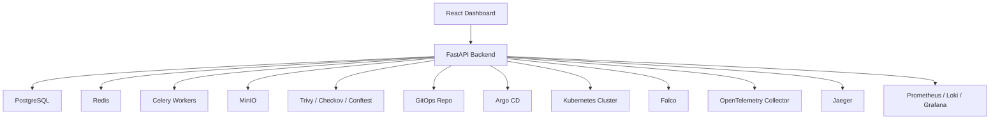
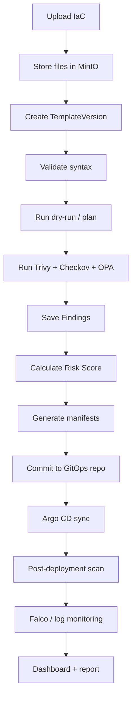
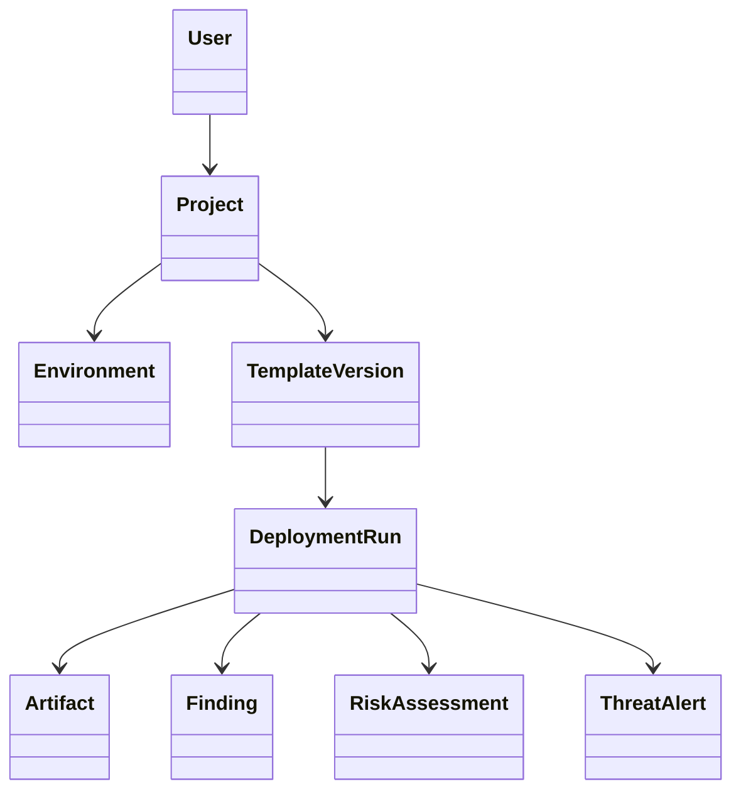

    # P2DP Architecture
## Global architecture overview

```mermaid
graph TD
A[React Dashboard] --> B[FastAPI Backend]

    B --> C[PostgreSQL]
    B --> D[Redis]
    B --> E[Celery Workers]
    B --> F[MinIO]

    B --> G[Trivy / Checkov / Conftest]
    B --> H[GitOps Repo]
    B --> I[Argo CD]
    B --> J[Kubernetes Cluster]
    B --> K[Falco]
    B --> L[OpenTelemetry Collector]
    B --> M[Jaeger]
    B --> N[Prometheus / Loki / Grafana]
```

## Full Workflow 

```mermaid
flowchart TB
    A[Upload IaC]
    B[Store files in MinIO]
    C[Create TemplateVersion]
    D[Validate syntax]
    E[Run dry-run / plan]
    F[Run Trivy + Checkov + OPA]
    G[Save Findings]
    H[Calculate Risk Score]
    I[Generate manifests]
    J[Commit to GitOps repo]
    K[Argo CD sync]
    L[Post-deployment scan]
    M[Falco / log monitoring]
    N[Dashboard + report]

    A --> B
    B --> C
    C --> D
    D --> E
    E --> F
    F --> G
    G --> H
    H --> I
    I --> J
    J --> K
    K --> L
    L --> M
    M --> N
```

### Database schema (simplified)

```mermaid
classDiagram
    class User
    class Project
    class Environment
    class TemplateVersion
    class DeploymentRun
    class Artifact
    class Finding
    class RiskAssessment
    class ThreatAlert

    User --> Project
    Project --> Environment
    Project --> TemplateVersion
    TemplateVersion --> DeploymentRun
    DeploymentRun --> Artifact
    DeploymentRun --> Finding
    DeploymentRun --> RiskAssessment
    DeploymentRun --> ThreatAlert
```